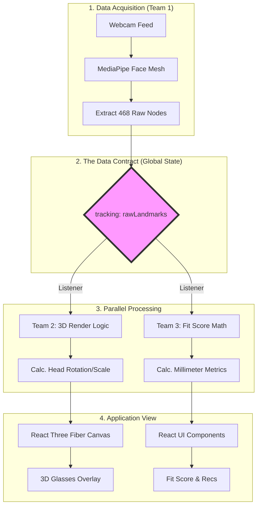

# FrameSense

A real-time augmented reality tool that helps you visualize and find glasses that *actually fit your face*.

---

## What Is FrameSense?

FrameSense addresses the primary driver of high online eyewear returns—poor physical fit—by shifting virtual try-on from a purely aesthetic novelty to a precise computational tool. While existing AR filters can show a user if they like a specific style, they cannot guarantee the frames won't painfully pinch their temples or continuously slide down their nose. By extracting real-time facial geometry to calculate exact anatomical measurements like interpupillary distance and bridge width, FrameSense cross-references these physical constraints against exact frame specifications. This generates an interpretable **Fit Score** that ensures the recommended glasses will physically fit the user's face in the real world, empowering buyers to make confident, data-driven purchasing decisions that directly reduce costly post-purchase returns.

---

## System Architecture



---

## Tech Stack

- **Frontend:** React 19 + TypeScript (Vite)
- **Computer Vision:** MediaPipe Face Mesh (468 facial landmarks)
- **3D Rendering:** React Three Fiber / Three.js
- **State Management:** Zustand
- **Optional Backend:** FastAPI (Python) for model inference or database queries

---

## Getting Started

### Prerequisites

Make sure you have the following installed:

- [Node.js](https://nodejs.org/) (v18 or higher recommended)
- npm (comes with Node.js)

### Installation & Running Locally

1. **Clone the repository**

   ```bash
   git clone https://github.com/your-org/FrameSense.git
   cd FrameSense
   ```

2. **Install frontend dependencies**

   ```bash
   cd frontend
   npm install
   ```

3. **Start the development server**

   ```bash
   npm run dev
   ```

4. **Open the app in your browser**

   Navigate to [http://localhost:5173](http://localhost:5173)

   > The app requires webcam access. Make sure to allow camera permissions when prompted.

### Other Useful Commands

| Command | Description |
|---|---|
| `npm run dev` | Start the local development server with hot reload |
| `npm run build` | Build the app for production |
| `npm run preview` | Preview the production build locally |
| `npm run lint` | Run ESLint to check for code issues |

---

## Team

Dhoopshikha Basgeet, Rohan Bhat, Darin Hall, Jani Ntowe-Fankam, Wiam Skakri, Julian Woel-Popovich

*CSDS 395 — Prof. Shuai Xu*
