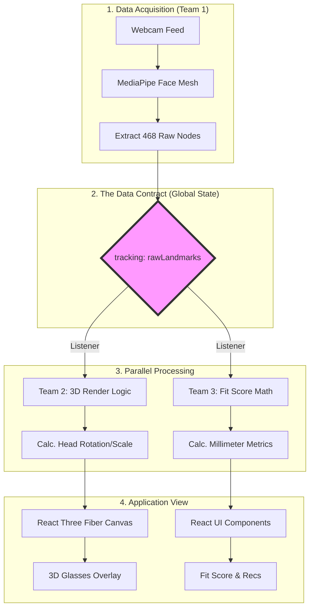

```mermaid
graph TD
    subgraph "1. Data Acquisition (Team 1)"
        A[Webcam Feed] --> B[MediaPipe Face Mesh]
        B --> C[Extract 468 Raw Nodes]
    end

    subgraph "2. The Data Contract (Global State)"
        C --> D{tracking: rawLandmarks}
        style D fill:#f9f,stroke:#333,stroke-width:4px
    end

    subgraph "3. Parallel Processing"
        D -->|Listener| E[Team 2: 3D Render Logic]
        D -->|Listener| F[Team 3: Fit Score Math]
        
        E --> G[Calc. Head Rotation/Scale]
        F --> H[Calc. Millimeter Metrics]
    end

    subgraph "4. Application View"
        G --> I[React Three Fiber Canvas]
        H --> J[React UI Components]
        I --> K[3D Glasses Overlay]
        J --> L[Fit Score & Recs]
    end
```
